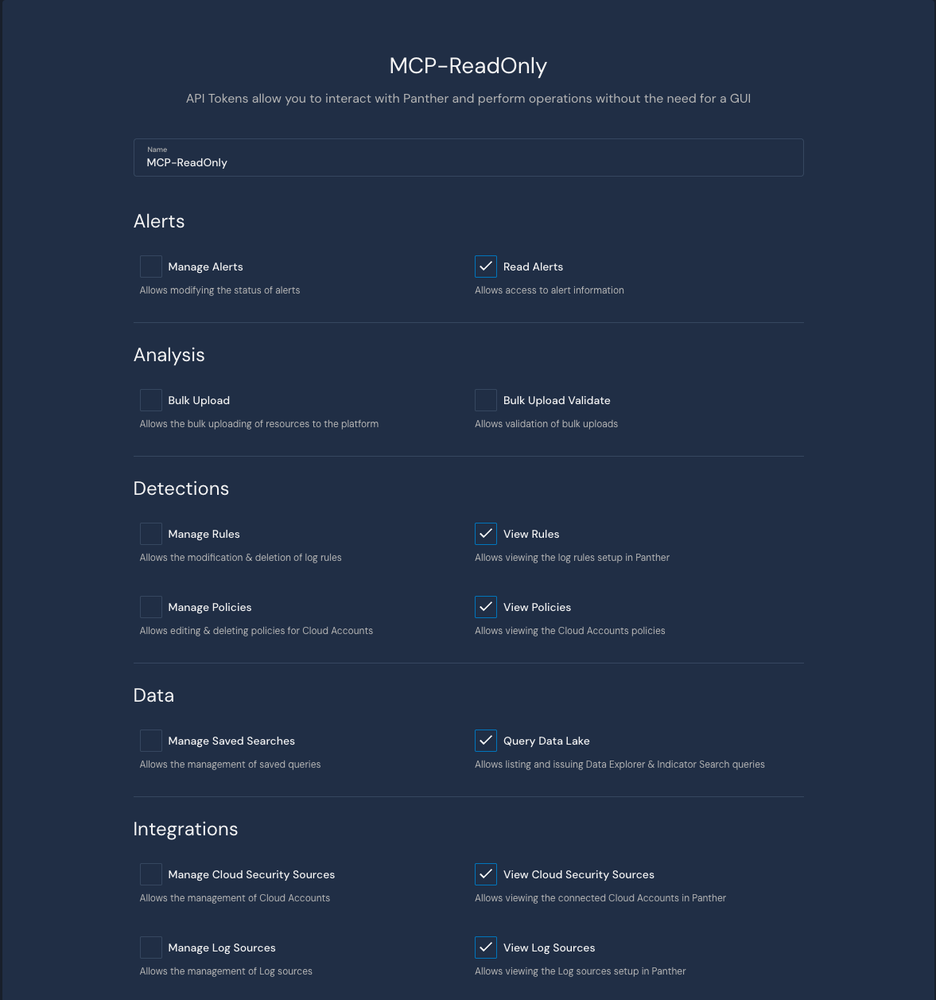
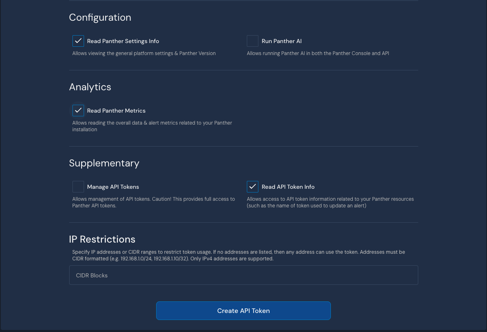
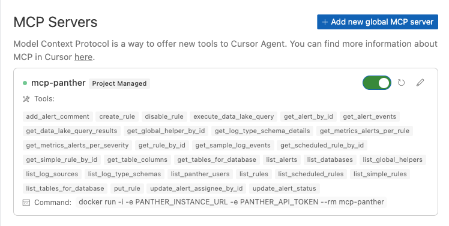
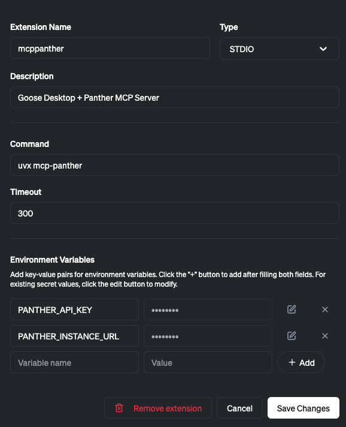

# Panther MCP Server

[](https://github.com/astral-sh/ruff)

Panther's Model Context Protocol (MCP) server provides functionality to:

1. **Write and tune detections from your IDE**
2. **Interactively query security logs using natural language**
3. **Triage, comment, and resolve one or many alerts**

<a href="https://glama.ai/mcp/servers/@panther-labs/mcp-panther">
  
</a>

## Available Tools

<details>
<summary><strong>Alerts</strong></summary>

| Tool Name | Description | Sample Prompt |
|-----------|-------------|---------------|
| `add_alert_comment` | Add a comment to a Panther alert | "Add comment 'Looks pretty bad' to alert abc123" |
| `start_ai_alert_triage` | Start an AI-powered triage analysis for a Panther alert with intelligent insights and recommendations | "Start AI triage for alert abc123" / "Generate a detailed AI analysis of alert def456" |
| `get_ai_alert_triage_summary` | Retrieve the latest AI triage summary previously generated for a specific alert | "Get the AI triage summary for alert abc123" / "Show me the AI analysis for alert def456" |
| `get_alert` | Get detailed information about a specific alert | "What's the status of alert 8def456?" |
| `get_alert_events` | Get a small sampling of events for a given alert | "Show me events associated with alert 8def456" |
| `list_alerts` | List alerts with comprehensive filtering options (date range, severity, status, etc.) | "Show me all high severity alerts from the last 24 hours" |
| `bulk_update_alerts` | Bulk update multiple alerts with status, assignee, and/or comment changes | "Update alerts abc123, def456, and ghi789 to resolved status and add comment 'Fixed'" |
| `update_alert_assignee` | Update the assignee of one or more alerts | "Assign alerts abc123 and def456 to John" |
| `update_alert_status` | Update the status of one or more alerts | "Mark alerts abc123 and def456 as resolved" |
| `list_alert_comments` | List all comments for a specific alert | "Show me all comments for alert abc123" |

</details>

<details>
<summary><strong>Data Lake</strong></summary>

| Tool Name | Description | Sample Prompt |
|-----------|-------------|---------------|
| `query_data_lake` | Execute SQL queries against Panther's data lake with synchronous results | "Query AWS CloudTrail logs for failed login attempts in the last day" |
| `get_table_schema` | Get schema information for a specific table | "Show me the schema for the AWS_CLOUDTRAIL table" |
| `list_databases` | List all available data lake databases in Panther | "List all available databases" |
| `list_database_tables` | List all available tables for a specific database in Panther's data lake | "What tables are in the panther_logs database" |
| `get_alert_event_stats` | Analyze patterns and relationships across multiple alerts by aggregating their event data into time-based statistics | "Show me patterns in events from alerts abc123 and def456" |

</details>

<details>
<summary><strong>Scheduled Queries</strong></summary>

| Tool Name | Description | Sample Prompt |
|-----------|-------------|---------------|
| `list_scheduled_queries` | List all scheduled queries with pagination support | "Show me all scheduled queries" / "List the first 25 scheduled queries" |
| `get_scheduled_query` | Get detailed information about a specific scheduled query by ID | "Get details for scheduled query 'weekly-security-report'" |

</details>

<details>
<summary><strong>Sources</strong></summary>

| Tool Name | Description | Sample Prompt |
|-----------|-------------|---------------|
| `list_log_sources` | List log sources with optional filters (health status, log types, integration type) | "Show me all healthy S3 log sources" |
| `get_http_log_source` | Get detailed information about a specific HTTP log source by ID | "Show me the configuration for HTTP source 'webhook-collector-123'" |

</details>

<details>
<summary><strong>Detections</strong></summary>

| Tool Name | Description | Sample Prompt |
|-----------|-------------|---------------|
| `list_detections` | List detections from Panther with comprehensive filtering support. Supports multiple detection types and filtering by name, state, severity, tags, log types, resource types, output IDs (destinations), and more. Returns outputIDs for each detection showing configured alert destinations | "Show me all enabled HIGH severity rules with tag 'AWS'" / "List disabled policies for S3 resources" / "Find all rules with outputID 'prod-slack'" / "Show me detections that alert to production destinations" |
| `get_detection` | Get detailed information about a specific detection including the detection body and tests. Accepts a list with one detection type: ["rules"], ["scheduled_rules"], ["simple_rules"], or ["policies"] | "Get details for rule ID abc123" / "Get details for policy ID AWS.S3.Bucket.PublicReadACP" |
| `disable_detection` | Disable a detection by setting enabled to false. Supports rules, scheduled_rules, simple_rules, and policies | "Disable rule abc123" / "Disable policy AWS.S3.Bucket.PublicReadACP" |

</details>

<details>
<summary><strong>Global Helpers</strong></summary>

| Tool Name | Description | Sample Prompt |
|-----------|-------------|---------------|
| `list_global_helpers` | List global helper functions with comprehensive filtering options (name search, creator, modifier) | "Show me global helpers containing 'aws' in the name" |
| `get_global_helper` | Get detailed information and complete Python code for a specific global helper | "Get the complete code for global helper 'AWSUtilities'" |

</details>

<details>
<summary><strong>Data Models</strong></summary>

| Tool Name | Description | Sample Prompt |
|-----------|-------------|---------------|
| `list_data_models` | List data models that control UDM mappings in rules | "Show me all data models for log parsing" |
| `get_data_model` | Get detailed information about a specific data model | "Get the complete details for the 'AWS_CloudTrail' data model" |

</details>

<details>
<summary><strong>Schemas</strong></summary>

| Tool Name | Description | Sample Prompt |
|-----------|-------------|---------------|
| `list_log_type_schemas` | List available log type schemas with optional filters | "Show me all AWS-related schemas" |
| `get_log_type_schema_details` | Get detailed information for specific log type schemas | "Get full details for AWS.CloudTrail schema" |

</details>

<details>
<summary><strong>Metrics</strong></summary>

| Tool Name | Description | Sample Prompt |
|-----------|-------------|---------------|
| `get_rule_alert_metrics` | Get metrics about alerts grouped by rule | "Show top 10 rules by alert count" |
| `get_severity_alert_metrics` | Get metrics about alerts grouped by severity | "Show alert counts by severity for the last week" |
| `get_bytes_processed_metrics` | Get data ingestion metrics by log type and source | "Show me data ingestion volume by log type" |

</details>

<details>
<summary><strong>Users & Access Management</strong></summary>

| Tool Name | Description | Sample Prompt |
|-----------|-------------|---------------|
| `list_users` | List all Panther user accounts with pagination support | "Show me all active Panther users" / "List the first 25 users" |
| `get_user` | Get detailed information about a specific user | "Get details for user ID '<john.doe@company.com>'" |
| `get_permissions` | Get the current user's permissions | "What permissions do I have?" |
| `list_roles` | List all roles with filtering options (name search, role IDs, sort direction) | "Show me all roles containing 'Admin' in the name" |
| `get_role` | Get detailed information about a specific role including permissions | "Get complete details for the 'Admin' role" |

</details>

## Panther Configuration

**Follow these steps to configure your API credentials and environment.**

1. Create an API token in Panther:
   - Navigate to Settings (gear icon) → API Tokens
   - Create a new token with the following permissions (recommended read-only approach to start):
   - <details>
     <summary><strong>View Required Permissions</strong></summary>

     
     

     </details>

2. Store the generated token securely (e.g., 1Password)

3. Copy the Panther instance URL from your browser (e.g., `https://YOUR-PANTHER-INSTANCE.domain`)
    - Note: This must include `https://`

## MCP Server Installation

**Choose one of the following installation methods:**

### Docker (Recommended)

The easiest way to get started is using our pre-built Docker image:

```json
{
  "mcpServers": {
    "mcp-panther": {
      "command": "docker",
      "args": [
        "run",
        "-i",
        "-e", "PANTHER_INSTANCE_URL",
        "-e", "PANTHER_API_TOKEN",
        "--rm",
        "ghcr.io/panther-labs/mcp-panther"
      ],
      "env": {
        "PANTHER_INSTANCE_URL": "https://YOUR-PANTHER-INSTANCE.domain",
        "PANTHER_API_TOKEN": "YOUR-API-KEY"
      }
    }
  }
}
```

**Version Pinning:** For production stability, pin to a specific version tag:

```json
"ghcr.io/panther-labs/mcp-panther:v2.2.0"
```

Available tags can be found on the [GitHub Container Registry](https://github.com/panther-labs/mcp-panther/pkgs/container/mcp-panther).

### UVX

For Python users, you can run directly from PyPI using uvx:

1. [Install UV](https://docs.astral.sh/uv/getting-started/installation/)

2. Configure your MCP client:

```json
{
  "mcpServers": {
    "mcp-panther": {
      "command": "uvx",
      "args": ["mcp-panther"],
      "env": {
        "PANTHER_INSTANCE_URL": "https://YOUR-PANTHER-INSTANCE.domain",
        "PANTHER_API_TOKEN": "YOUR-PANTHER-API-TOKEN"
      }
    }
  }
}
```

**Version Pinning:** For production stability, pin to a specific version:

```json
"args": ["mcp-panther==2.2.0"]
```

Available versions can be found on [PyPI](https://pypi.org/project/mcp-panther/).

## MCP Client Setup

### Cursor

[Follow the instructions here](https://docs.cursor.com/context/model-context-protocol#configuring-mcp-servers) to configure your project or global MCP configuration. **It's VERY IMPORTANT that you do not check this file into version control.**

Once configured, navigate to Cursor Settings > MCP to view the running server:



**Tips:**

- Be specific about where you want to generate new rules by using the `@` symbol and then typing a specific directory.
- For more reliability during tool use, try selecting a specific model, like Claude 3.7 Sonnet.
- If your MCP Client is failing to find any tools from the Panther MCP Server, try restarting the Client and ensuring the MCP server is running. In Cursor, refresh the MCP Server and start a new chat.

### Claude Code

[Claude Code](https://code.claude.com/docs) is Anthropic's official CLI tool. Add the Panther MCP server using Docker:

```bash
claude mcp add-json panther '{
  "command": "docker",
  "args": [
    "run",
    "-i",
    "-e", "PANTHER_INSTANCE_URL",
    "-e", "PANTHER_API_TOKEN",
    "--rm",
    "ghcr.io/panther-labs/mcp-panther"
  ],
  "env": {
    "PANTHER_INSTANCE_URL": "https://YOUR-PANTHER-INSTANCE.domain",
    "PANTHER_API_TOKEN": "YOUR-API-TOKEN"
  }
}'
```

Alternatively, using UVX:

```bash
claude mcp add-json panther '{
  "command": "uvx",
  "args": ["mcp-panther"],
  "env": {
    "PANTHER_INSTANCE_URL": "https://YOUR-PANTHER-INSTANCE.domain",
    "PANTHER_API_TOKEN": "YOUR-API-TOKEN"
  }
}'
```

After adding, verify the server is configured:

```bash
claude mcp list
```

### Claude Desktop

To use with Claude Desktop, manually configure your `claude_desktop_config.json`:

1. Open the Claude Desktop settings and navigate to the Developer tab
2. Click "Edit Config" to open the configuration file
3. Add the following configuration:

```json
{
  "mcpServers": {
    "mcp-panther": {
      "command": "uvx",
      "args": ["mcp-panther"],
      "env": {
        "PANTHER_INSTANCE_URL": "https://YOUR-PANTHER-INSTANCE.domain",
        "PANTHER_API_TOKEN": "YOUR-PANTHER-API-TOKEN"
      }
    }
  }
}
```

4. Save the file and restart Claude Desktop

If you run into any issues, [try the troubleshooting steps here](https://modelcontextprotocol.io/quickstart/user#troubleshooting).

### Goose CLI

Use with [Goose CLI](https://block.github.io/goose/docs/getting-started/installation/), Block's open-source AI agent:

```bash
# Start Goose with the MCP server
goose session --with-extension "uvx mcp-panther"
```

### Goose Desktop

Use with [Goose Desktop](https://block.github.io/goose/docs/getting-started/installation/), Block's open-source AI agent:

From 'Extensions' -> 'Add custom extension' provide your configuration information.



## Running the Server

The MCP Panther server supports multiple transport protocols:

### STDIO (Default)

For local development and MCP client integration:

```bash
uv run python -m mcp_panther.server
```

### Streamable HTTP

For running as a persistent web service, use the HTTP transport. This is ideal for:
- Long-running server deployments
- Multiple clients connecting to the same server
- Testing and debugging with continuous log monitoring

#### Using Docker Run (Detached)

```bash
docker run -d \
  --name panther-mcp-server \
  -p 8000:8000 \
  -e PANTHER_INSTANCE_URL=https://YOUR-PANTHER-INSTANCE.domain \
  -e PANTHER_API_TOKEN=YOUR-API-TOKEN \
  -e MCP_TRANSPORT=streamable-http \
  -e MCP_HOST=0.0.0.0 \
  -e MCP_PORT=8000 \
  -e LOG_LEVEL=INFO \
  --restart unless-stopped \
  ghcr.io/panther-labs/mcp-panther:latest
```

#### Using Docker Compose (Recommended)

Create a `docker-compose.yml` file:

```yaml
services:
  panther-mcp:
    image: ghcr.io/panther-labs/mcp-panther:latest
    container_name: panther-mcp-server
    ports:
      - "8000:8000"
    environment:
      - PANTHER_INSTANCE_URL=https://YOUR-PANTHER-INSTANCE.domain
      - PANTHER_API_TOKEN=YOUR-API-TOKEN
      - MCP_TRANSPORT=streamable-http
      - MCP_HOST=0.0.0.0
      - MCP_PORT=8000
      - LOG_LEVEL=INFO
    restart: unless-stopped
```

Start the server:

```bash
# Start in detached mode
docker-compose up -d

# View logs
docker-compose logs -f

# Stop the server
docker-compose down
```

#### Connecting Claude Code to HTTP Server

**Important:** The server runs on HTTP (not HTTPS). Configure Claude Code with the `http://` URL:

```bash
# Add the HTTP endpoint (note: http:// not https://)
claude mcp add-json panther-http '{
  "url": "http://localhost:8000/mcp"
}'

# Verify configuration
claude mcp list
```

#### Testing the Connection

```bash
# Test the HTTP endpoint
curl http://localhost:8000/mcp

# View server logs
docker logs -f panther-mcp-server
# Or with docker-compose:
docker-compose logs -f
```

You can also test using the FastMCP client:

```python
import asyncio
from fastmcp import Client

async def test_connection():
    async with Client("http://localhost:8000/mcp") as client:
        tools = await client.list_tools()
        print(f"Available tools: {len(tools)}")

asyncio.run(test_connection())
```

#### Troubleshooting Streamable HTTP

**Port Already in Use**

If you see `Bind for 0.0.0.0:8000 failed: port is already allocated`:

```bash
# Check what's using the port
lsof -i :8000

# Stop conflicting containers
docker ps | grep panther
docker stop <container-id>

# Or use a different port via MCP_PORT environment variable:
-e MCP_PORT=8080
# Then connect to: http://localhost:8080/mcp
```

**Invalid HTTP Request Warnings**

If you see `WARNING: Invalid HTTP request received` in the logs, this usually means:
- Claude Code is trying to connect via HTTPS instead of HTTP
- Check your configuration uses `http://` not `https://`
- Verify with: `claude mcp list`

### Environment Variables

- `MCP_TRANSPORT`: Set transport type (`stdio` or `streamable-http`)
- `MCP_PORT`: Port for HTTP transport (default: 3000)
- `MCP_HOST`: Host for HTTP transport (default: 127.0.0.1)
- `MCP_LOG_FILE`: Log file path (optional)

## Security Best Practices

We highly recommends the following MCP security best practices:

- **Apply strict least-privilege to Panther API tokens.** Scope tokens to the minimal permissions required and bind them to an IP allow-list or CIDR range so they're useless if exfiltrated. Rotate credentials on a preferred interval (e.g., every 30d).
- **Host the MCP server in a locked-down sandbox (e.g., Docker) with read-only mounts.** This confines any compromise to a minimal blast radius.
- **Monitor credential access to Panther and monitor for anomalies.** Write a Panther rule!
- **Run only trusted, officially signed MCP servers.** Verify digital signatures or checksums before running, audit the tool code, and avoid community tools from unofficial publishers.

## Troubleshooting

Check the server logs for detailed error messages: `tail -n 20 -F ~/Library/Logs/Claude/mcp*.log`. Common issues and solutions are listed below.

### Running tools

- If you get a `{"success": false, "message": "Failed to [action]: Request failed (HTTP 403): {\"error\": \"forbidden\"}"}` error, it likely means your API token lacks the particular permission needed by the tool.
- Ensure your Panther Instance URL is correctly set. You can view this in the `config://panther` resource from your MCP Client.

## Contributing

We welcome contributions to improve MCP-Panther! Here's how you can help:

1. **Report Issues**: Open an issue for any bugs or feature requests
2. **Submit Pull Requests**: Fork the repository and submit PRs for bug fixes or new features
3. **Improve Documentation**: Help us make the documentation clearer and more comprehensive
4. **Share Use Cases**: Let us know how you're using MCP-Panther and what could make it better

Please ensure your contributions follow our coding standards and include appropriate tests and documentation.

## Contributors

This project exists thanks to all the people who contribute. Special thanks to [Tomasz Tchorz](https://github.com/tomasz-sq) and [Glenn Edwards](https://github.com/glenn-sq) from [Block](https://block.xyz), who played a core role in launching MCP-Panther as a joint open-source effort with Panther.

See our [CONTRIBUTORS.md](.github/CONTRIBUTORS.md) for a complete list of contributors.

## License

This project is licensed under the Apache License 2.0 - see the LICENSE file for details.
