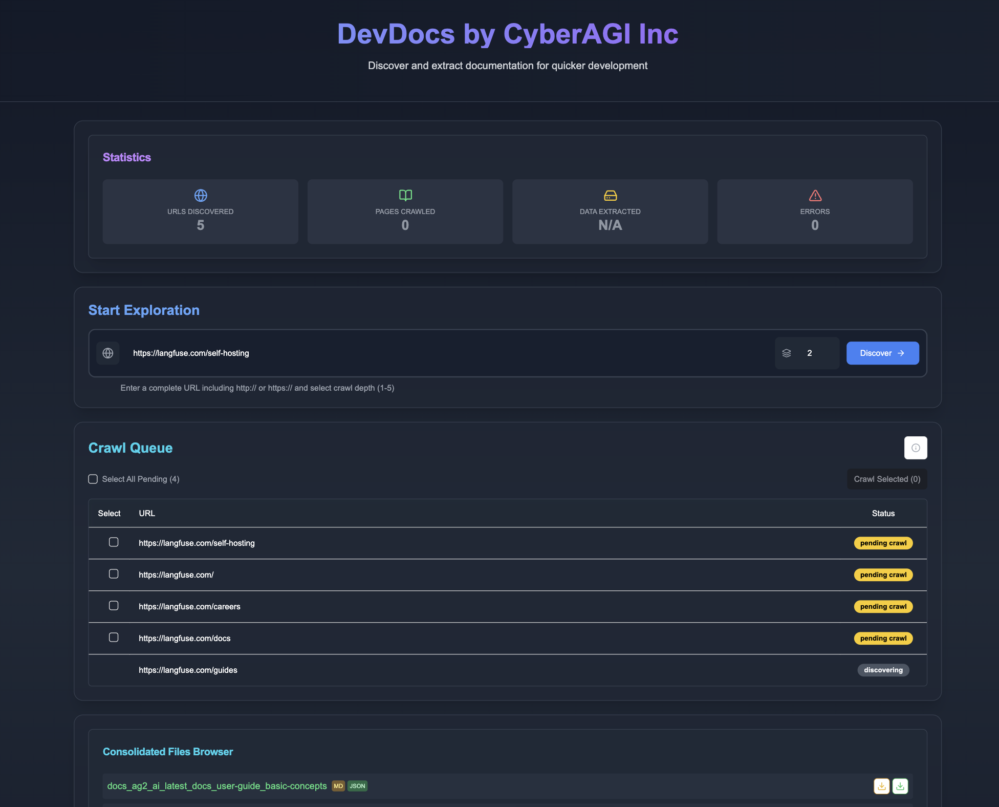

# DevDocs by CyberAGI 🚀
> [!WARNING]
> 📌 **DevDocs Status**: Not publicly maintained. Enhanced internal version at CyberAGI — public release coming soon. If you have any questions please reach out to info@cyberagi.ai

<div align="center">
  


  <p align="center">
    <strong>Turn Weeks of Documentation Research into Hours of Productive Development</strong>
  </p>

  <p align="center">
    <a href="#-perfect-for">Perfect For</a> •
    <a href="#-features">Features</a> •
    <a href="#-why-devdocs">Why DevDocs</a> •
    <a href="#-getting-started">Getting Started</a> •
    <a href="#-scripts-and-their-purpose">Scripts</a> •
    <a href="#-pricing-comparison">Compare to FireCrawl</a> •
    <a href="#-join-our-community">Discord</a> •
    <a href="#-devdocs-roadmap">DevDocs Roadmap</a>
  </p>
</div>

## 🚀 Technology Partners

<div align="center" style="display: flex; justify-content: center; align-items: center; gap: 30px; flex-wrap: wrap; padding: 20px 0;">

  
  
  
  
  
  
  

</div>

## 🎯 Perfect For

### 🏢 Enterprise Software Developers
Skip weeks of reading documentation and dealing with technical debt. Implement ANY technology faster by letting DevDocs handle the heavy lifting of documentation understanding.

### 🕸️ Web Scrapers
Pull entire contents of websites with Smart Discovery of Child URLs up to level 5. Perfect for both internal and external website documentation with intelligent crawling.

### 👥 Development Teams
Leverage internal documentation with built-in MCP servers and Claude integration for intelligent data querying. Transform your team's knowledge base into an actionable resource.

### 🚀 Indie Hackers
DevDocs + VSCode(cline) + Your Idea = Ship products fast with ANY technology. No more getting stuck in documentation hell when building your next big thing.

## ✨ Features

### 🧠 Intelligent Crawling
- **Smart Depth Control**: Choose crawl depth from 1-5 levels
- **Automatic Link Discovery**: Finds and categorizes all related content
- **Selective Crawling**: Pick exactly what you want to extract
- **Child URL Detection**: Automatically discovers and maps website structure

### ⚡ Performance & Speed
- **Parallel Processing**: Crawl multiple pages simultaneously
- **Smart Caching**: Never waste time on duplicate content
- **Lazy Loading Support**: Handles modern web apps effortlessly
- **Rate Limiting**: Respectful crawling that won't overload servers

### 🎯 Content Processing
- **Clean Extraction**: Get content without the fluff
- **Multiple Formats**: Export to MD or JSON for LLM fine-tuning
- **Structured Output**: Logically organized content
- **MCP Server Integration**: Ready for AI processing

### 🛡️ Enterprise Features
- **Error Recovery**: Auto-retry on failures
- **Full Logging**: Track every operation
- **API Access**: Integrate with your tools
- **Team Management**: Multiple seats and roles

## 🤔 Why DevDocs?

### The Problem
Documentation is everywhere and LLMs are OUTDATED in their knowledge. Reading it, understanding it, and implementing it takes weeks of research and development even for senior engineers. **We cut down that time to hours.**

### Our Solution
DevDocs brings documentation to you. Point it at any tech documentation URL, and watch as it:
1. Discovers all related pages to that technology
2. Extracts meaningful content without the fluff
3. Organizes information logically inside an MCP server ready for your LLM to query
4. Presents it in a clean, searchable format in MD or JSON for finetuning LLM purpose

🔥 We want anyone in the world to have the ability to build amazing products quickly using the most cutting edge LLM technology. 

## 💰 Pricing Comparison

| Feature | DevDocs | Firecrawl |
|---------|---------|-----------|
| Free Tier | Unlimited pages | None |
| Starting Price | Free Forever | $16/month |
| Enterprise Plan | Custom | $333/month |
| Crawl Speed | 1000/min | 20/min |
| Depth Levels | Up to 5 | Limited |
| Team Seats | Unlimited | 1-5 seats |
| Export Formats | MD, JSON, LLM-ready MCP servers | Limited formats |
| API Access | Coming Soon | Limited |
| Model Context Protocol Integration | ✅ | ❌ |
| Support | Priority Available via Discord | Standard only |
| Self-hosted (free use) | ✅ | ❌ |

## 🚀 Getting Started

DevDocs is designed to be easy to use with Docker, requiring minimal setup for new users.

### Prerequisites

- [Docker](https://docs.docker.com/get-docker/) installed on your system
- Git for cloning the repository

### Quick Start with Docker (Recommended)

For Mac/Linux users:
```bash
# Clone the repository
git clone https://github.com/cyberagiinc/DevDocs.git

# Navigate to the project directory
cd DevDocs

# Configure environment variables
# Copy the template file to .env
cp .env.template .env

# Ensure NEXT_PUBLIC_BACKEND_URL in .env is set correctly (e.g., http://localhost:24125)
# This allows the frontend (running in your browser) to communicate with the backend service.


# Start all services using Docker
./docker-start.sh
```

For Windows users: Experimental Only (Not Tested Yet)
```cmd
# Clone the repository
git clone https://github.com/cyberagiinc/DevDocs.git

# Navigate to the project directory

cd DevDocs

# Configure environment variables
# Copy the template file to .env

copy .env.template .env

# Ensure NEXT_PUBLIC_BACKEND_URL in .env is set correctly (e.g., http://localhost:24125)

# This allows the frontend (running in your browser) to communicate with the backend service.

# Prerequisites: Install WSL 2 and Docker Desktop
# Docker Desktop for Windows requires WSL 2. Please ensure you have WSL 2 installed and running first.
# 1. Install WSL 2: Follow the official Microsoft guide: https://learn.microsoft.com/en-us/windows/wsl/install
# 2. Install Docker Desktop for Windows: Download and install from the official Docker website. Docker Desktop includes Docker Compose.


# Start all services using Docker
docker-start.bat
```
<details>
<summary>Note for Windows Users</summary>

> If you encounter permission issues, you may need to run the script as administrator or manually set permissions on the logs, storage, and crawl_results directories. The script uses the `icacls` command to set permissions, which might require elevated privileges on some Windows systems.
>
> **Manually Setting Permissions on Windows**:
>
> If you need to manually set permissions, you can do so using either the Windows GUI or command line:
>
> **Using Windows Explorer**:
> 1. Right-click on each directory (logs, storage, crawl_results)
> 2. Select "Properties"
> 3. Go to the "Security" tab
> 4. Click "Edit" to change permissions
> 5. Click "Add" to add users/groups
> 6. Type "Everyone" and click "Check Names"
> 7. Click "OK"
> 8. Select "Everyone" in the list
> 9. Check "Full control" under "Allow"
> 10. Click "Apply" and "OK"
>
> **Using Command Prompt (as Administrator)**:
> ```cmd
> icacls logs /grant Everyone:F /T
> icacls storage /grant Everyone:F /T
> icacls crawl_results /grant Everyone:F /T
> ```
</details> 

<details>
<summary>Note about docker-compose.yml on Windows</summary>

> If you encounter issues with the docker-compose.yml file (such as "Top-level object must be a mapping" error), the `docker-start.bat` script automatically fixes this by ensuring the file has the correct format and encoding. This fix is applied every time you run the script, so you don't need to manually modify the file.
</details>


This single command will:
1. Create all necessary directories
2. Set appropriate permissions
3. Build and start all Docker containers
4. Monitor the services to ensure they're running properly

### Accessing DevDocs

Once the services are running:
- Frontend UI: http://localhost:3001
- Backend API: http://localhost:24125
- Crawl4AI Service: http://localhost:11235

### Logs and Monitoring

When using Docker, logs can be accessed :

1. **Container Logs** (recommended for debugging):
   ```bash
   # View logs from a specific container
   docker logs devdocs-frontend
   docker logs devdocs-backend
   docker logs devdocs-mcp
   docker logs devdocs-crawl4ai
   
   # Follow logs in real-time
   docker logs -f devdocs-backend
   ```

To stop all services, press `Ctrl+C` in the terminal where docker-start is running.

## 📜 Scripts and Their Purpose

DevDocs includes various utility scripts to help with development, testing, and maintenance. Here's a quick reference:

### Startup Scripts
- `start.sh` / `start.bat` / `start.ps1` - Start all services (frontend, backend, MCP) for local development.
- `docker-start.sh` / `docker-start.bat` - Start all services using Docker containers.

### MCP Server Scripts
- `check_mcp_health.sh` - Verify the MCP server's health and configuration status.
- `restart_and_test_mcp.sh` - Restart Docker containers with updated MCP configuration and test connectivity.

### Crawl4AI Scripts
- `check_crawl4ai.sh` - Check the status and health of the Crawl4AI service.
- `debug_crawl4ai.sh` - Run Crawl4AI in debug mode with verbose logging for troubleshooting.
- `test_crawl4ai.py` - Run tests against the Crawl4AI service to verify functionality.
- `test_from_container.sh` - Test the Crawl4AI service from within a Docker container.

### Utility Scripts
- `view_result.sh` - Display crawl results in a formatted view.
- `find_empty_folders.sh` - Identify empty directories in the project structure.
- `analyze_empty_folders.sh` - Analyze empty folders and categorize them by risk level.
- `verify_reorganization.sh` - Verify that code reorganization was successful.

These scripts are organized in the following directories:
- Root directory: Main scripts for common operations
- `scripts/general/`: General utility scripts
- `scripts/docker/`: Docker-specific scripts
- `scripts/mcp/`: MCP server management scripts
- `scripts/test/`: Testing and verification scripts

## 🌍 Built for Developers, by Developers

DevDocs is more than a tool—it's your documentation companion that:
- **Saves Time**: Turn weeks of research into hours
- **Improves Understanding**: Get clean, organized documentation
- **Enables Innovation**: Build faster with any technology
- **Supports Teams**: Share knowledge efficiently
- **LLM READY**: Modern times require modern solutions, using devdocs with LLM is extremely easy and intuitive. With minimal configuration you can run Devdocs and Claude App and  recognizes DevDocs's MCP server ready to chat with your data. 

## 🛠️ Setting Up the Cline/Roo Cline for Rapid software development.

1. **Open the "Modes" Interface**  
   - In **Roo Code**, click the **+** to create a new Mode-Specific Prompts.
   <br>
   
2. **Name**  
   - Give the mode a **Name** (e.g., `Research_MCP`).  
   <br>
3. **Role Definition Prompt**
  <details>
  <summary>Prompt</summary>

```
Expertise and Personality: Expertise: Developer documentation retrieval, technical synthesis, and documentation search. Personality: Systematic, detail-oriented, and precise. Provide well-structured answers with clear references to documentation sections.

Behavioral Mandate: Always use the Table Of Contents and Section Access tools when addressing any query regarding the MCP documentation. Maintain clarity, accuracy, and traceability in your responses.
```
  </details>
 <br>

4. **Mode-Specific Custom Instructions Prompt**
<details>
<summary> Prompt </summary>


```
1. Table Of Contents Tool: Returns a full or filtered list of documentation topics. 
2. Section Access Tool: Retrieves the detailed content of specific documentation sections.

General Process: Query Interpretation: Parse the user's query to extract key topics, keywords, and context. Identify the likely relevant sections (e.g., API configurations, error handling) from the query.

Discovery via Table Of Contents: Use the Table Of Contents tool to search the documentation index for relevant sections. Filter or scan titles and metadata for matching keywords.

Drill-Down Using Section Access: For each identified relevant document or section, use the Section Access tool to retrieve its content. If multiple parts are needed, request all related sections to ensure comprehensive coverage.

Synthesis and Response Formation: Combine the retrieved content into a coherent and complete answer. Reference section identifiers or document paths for traceability. Validate that every aspect of the query has been addressed.

Error Handling: If no matching sections are found, adjust the search parameters and retry. Clearly report if the query remains ambiguous or if no relevant documentation is available.

Mandatory Tool Usage: 
Enforcement: Every time a query is received that requires information from the MCP server docs, the agent MUST first query the Table Of Contents tool to list potential relevant topics, then use the Section Access tool to retrieve the necessary detailed content.

Search & Retrieve Workflow: 
Interpret and Isolate: Identify the key terms and data points from the user's query.

Index Lookup: Immediately query the Table Of Contents tool to obtain a list of relevant documentation sections.

Targeted Retrieval: For each promising section, use the Section Access tool to get complete content.

Information Synthesis: Merge the retrieved content, ensuring all necessary details are included and clearly referenced.

Fallback and Clarification: If initial searches yield insufficient data, adjust the query parameters and retrieve additional sections as needed.

Custom Instruction Loading: Additional custom instructions specific to Research_MCP mode may be loaded from the .clinerules-research-mcp file in your workspace. These may include further refinements or constraints based on evolving documentation structures or query types.

Final Output Construction: The final answer should be organized, directly address the query, and include clear pointers (e.g., section names or identifiers) back to the MCP documentation. Ensure minimal redundancy while covering all necessary details.
```

</details>
 <br>

## 🤝 Join Our Community

- 🌟 [Star us on GitHub](https://github.com/cyberagi/devdocs)
- 👋🏽 [Reach out to our founder on Linkedin](https://www.linkedin.com/in/shubhamkhichi/)
- 💬 [Join our Discord Community](https://discord.gg/2594NueRg8)

## 🏆 Success Stories

"DevDocs turned our 3-week implementation timeline into 2 days. It's not just a crawler, it's a development accelerator." - *Senior Engineer at Fortune 100 Company*

"Launched my SaaS in half the time by using DevDocs to understand and implement new technologies quickly." - *Successful Indie Hacker*

## 🛣️ DevDocs Roadmap

This roadmap outlines the upcoming enhancements and features planned for DevDocs, our advanced web crawling platform powered by Crawl4AI. Each item is designed to leverage Crawl4AI’s capabilities to their fullest, ensuring a robust, efficient, and user-friendly web crawling experience.

⸻

### 1. Enhanced Crawler Logic for Dynamic Content

- Implement `wait_for_images=True` to ensure all images are fully loaded before extraction.
- Set `scan_full_page=True` to force the crawler to scroll through the entire page, triggering lazy-loaded content.
- Introduce `scroll_delay` to add delays between scroll steps, allowing content to load properly.
- Incorporate `wait_for` parameters to wait for specific DOM elements indicative of content loading completion.

---

### 2. Hot Loading with Browser Pooling

- Implement a pool of pre-warmed browser instances to avoid the overhead of launching a new browser for each task.
- Utilize `use_persistent_context=True` to maintain session data across tasks, reducing the need for repeated logins and setups.

---

### 3. Revamped Docker Containers with Latest DevDocs Integration

- Update Docker images to incorporate the latest DevDocs features and optimizations.
- Include environment variables for API tokens (`CRAWL4AI_API_TOKEN`) to secure API endpoints.
- Set appropriate memory limits and resource constraints to optimize performance.

---

### 4. Multi-OS Docker Instance Support

- Create Docker images for different architectures (e.g., `x86_64`, `ARM`) to support a wide range of systems.
- Implement CI/CD pipelines to build and test images across multiple OS environments, ensuring compatibility and stability.

---

### 5. Memory-Adaptive Crawling

- Integrate DevDocs’ `MemoryAdaptiveDispatcher` to dynamically adjust concurrency based on system memory availability.
- Implement built-in rate limiting to prevent overwhelming target websites and avoid out-of-memory errors.

---

### 6. PDF Upload and Extraction in UI

- Utilize DevDocs’ capability to export pages as PDFs (`pdf=True`) and extract content from them.
- Develop frontend components to handle PDF uploads, display extracted content, and allow users to interact with the data.

---

### 7. Hosted Environment with Persistent Storage and Enhanced UX

- Implement BYO-databases solutions to store data privately, crawl results, and configurations across sessions.
- Design intuitive dashboards and interfaces for users to manage their crawls, view results, and configure settings.
- Ensure responsive design and accessibility across various browsers.

## Star History

[](https://star-history.com/#cyberagiinc/DevDocs&Timeline)

<p align="center">Made with ❤️ by <a href="https://www.cyberagi.ai">CyberAGI Inc</a> in 🇺🇸</p>

<p align="center">
  <sub>Make Software Development Better Again <a href="https://github.com/cyberagi/devdocs">Contribute to DevDocs</a></sub>
</p>

