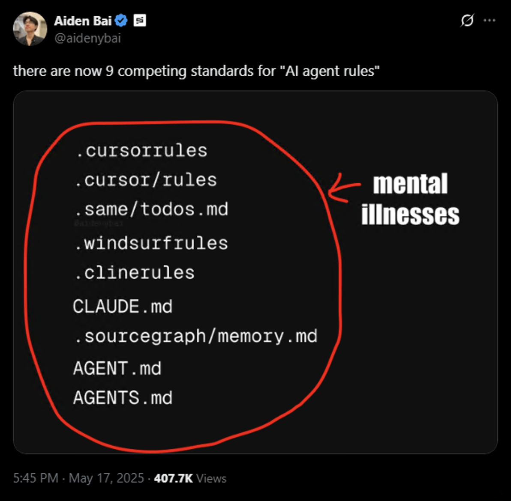

[](https://www.npmjs.com/package/@valstro/markdown-rules-mcp) [](https://smithery.ai/server/@valstro/markdown-rules-mcp) [](https://opensource.org/licenses/MIT)

# Markdown Rules MCP Server

**The portable alternative to Cursor Rules and IDE-specific rules.** 

Transform your project documentation into intelligent AI context using standard Markdown files that work across any MCP-compatible AI tool. <u>Escape vendor lock-in and scattered documentation forever.</u>

<a href="https://x.com/aidenybai/status/1923781810820968857" target="_blank"></a>

## Why Choose Markdown Rules?

🚀 **Universal Compatibility** — Write once, use everywhere. Your documentation works with Cursor, Claude Desktop, and any future MCP-enabled AI tool. <u>No vendor lock-in.</u>

🔗 **Smart Dependency Resolution** — Automatically traverse and include linked files & docs, ensuring AI agents receive complete context for complex projects without manual file hunting or relying on the AI agent to follow links.

🎯 **Precision Context Control** — Inject exact inline code snippets with line-range embeds (`?md-embed=50-100`) instead of dumping entire files. Get relevant context, not noise.

🏗️ **Perfect for Complex Codebases** — Ideal for large projects with custom tooling, internal libraries, or proprietary frameworks that AI models have limited training data for. Provide the context they need to understand your unique architecture.

## Prerequisites 📋

- [Node.js](https://nodejs.org/) (v18 or higher)
- [Cursor](https://www.cursor.com/) or other MCP supported AI coding tools

## Installation 🛠️

### Installing via Smithery

To install the Markdown Rules MCP server for your IDE automatically via [Smithery](https://smithery.ai/server/@valstro/markdown-rules-mcp):

```bash
# Cursor
npx -y @smithery/cli install markdown-rules-mcp --client cursor
```

```bash
# Windsurf
npx -y @smithery/cli install markdown-rules-mcp --client windsurf
```

See [Smithery](https://smithery.ai/server/@valstro/markdown-rules-mcp) for installation options for other IDEs.

### Manual Installation

#### MacOS / Linux

```json
{
  "mcpServers": {
    "markdown-rules-mcp": {
      "command": "npx",
      "args": ["-y", "@valstro/markdown-rules-mcp@latest"],
      "env": {
        "PROJECT_ROOT": "/absolute/path/to/project/root",
        "MARKDOWN_INCLUDE": "./docs/**/*.md",
        "HOIST_CONTEXT": true
      }
    }
  }
}
```

#### Windows

```json
{
  "mcpServers": {
    "markdown-rules-mcp": {
      "command": "cmd.exe",
      "args": [
        "/c",
        "npx",
        "-y",
        "@valstro/markdown-rules-mcp@latest"
      ],
      "env": {
        "PROJECT_ROOT": "/absolute/path/to/project/root",
        "MARKDOWN_INCLUDE": "./docs/**/*.md",
        "HOIST_CONTEXT": true
      }
    }
  }
}
```

## Configuring Usage Instructions (Optional)

To change the default usage instructions, create a `markdown-rules.md` file in your project root. The file should contain the usage instructions for the `get_relevant_docs` tool.

The default usage instructions are:

```markdown
# Usage Instructions

*   You **must** call the `get_relevant_docs` MCP tool before providing your first response in any new chat session.
*   After the initial call in a chat, you should **only** call `get_relevant_docs` again if one of these specific situations occurs:
    *   The user explicitly requests it.
    *   The user attaches new files.
    *   The user's query introduces a completely new topic unrelated to the previous discussion.
```

Note: You can change the default usage instructions file path by adding the `USAGE_INSTRUCTIONS_PATH` environment variable to the MCP server configuration.

## Tools

- `get_relevant_docs` - Get relevant docs based on the user's query. Is called based on the [usage instructions](#configuring-usage-instructions-optional).
- `list_indexed_docs` - Count and preview indexed docs & usage instructions. Useful for debugging.
- `reindex_docs` - Reindex the docs. Useful if docs in the index have changed or new docs have been added.

## How To Use 📝

Create `.md` files in your project with YAML frontmatter to define how they should be included in AI context.

### Document Types

| Type | Frontmatter | Description | When Included |
|------|-------------|-------------|---------------|
| **Global** | `alwaysApply: true` | Always included in every AI conversation | Automatically, every time |
| **Auto-Attached** | `globs: ["**/*.ts", "src/**"]` | Included when attached files match the glob patterns | When you attach matching files |
| **Agent-Requested** | `description: "Brief summary"` | Available for AI to select based on relevance | When AI determines it's relevant to your query |
| **No Frontmatter** | None | Must be included in the prompt manually with @ symbol | When AI determines it's relevant to your query |

### Frontmatter Examples

**Global (always included):**

```markdown
---
description: Project Guidelines
alwaysApply: true
---
# Project Guidelines

This doc will always be included.
```

**Auto-attached (included when TypeScript files are attached):**

```markdown
---
description: TypeScript Coding Standards
globs: ["**/*.ts", "**/*.tsx"]
---
# TypeScript Coding Standards

This doc will be included when TypeScript files are attached.
```

**Agent-requested (available for AI to select based on relevance):**
```markdown
---
description: Database Schema and Migration Guide
---
# Database Schema and Migration Guide

This doc will be included when AI selects it based on relevance.
```

**No frontmatter (must be included in the prompt manually with @ symbol):**

```markdown
# Testing Guidelines

This doc needs manual inclusion with @ symbol
```

### Linking Files

**Link other files:** Add `?md-link=true` to include linked files in context
```markdown
See [utilities](./src/utils.ts?md-link=true) for helper functions.
```

**Embed specific lines:** Add `?md-embed=START-END` to include only specific lines inline
```markdown
Configuration: [API Settings](./config.json?md-embed=1-10)
```

### Configuration

- `PROJECT_ROOT` - Default: `process.cwd()` - The absolute path to the project root.
- `MARKDOWN_INCLUDE` - Default: `**/*.md` - Pattern to find markdown doc files
- `HOIST_CONTEXT` - Default: `true` - Whether to show linked files before the docs that reference them
- `MARKDOWN_EXCLUDE` - Default: `**/node_modules/**,**/build/**,**/dist/**,**/.git/**,**/coverage/**,**/.next/**,**/.nuxt/**,**/out/**,**/.cache/**,**/tmp/**,**/temp/**` - Patterns to ignore when finding markdown files

## Example 📝

Imagine you have the following files in your project:

**`project-overview.md`:**

```markdown
---
description: Project Overview and Setup
alwaysApply: true
---
# Project Overview

This document covers the main goals and setup instructions.

See the [Core Utilities](./src/utils.ts?md-link=true) for essential functions.

For configuration details, refer to this section: [Config Example](./config.json?md-embed=1-3)
```

**`src/utils.ts`:**

```typescript
// src/utils.ts
export function helperA() {
  console.log("Helper A");
}

export function helperB() {
  console.log("Helper B");
}
```

**`config.json`:**

```json
{
  "timeout": 5000,
  "repeats": 3,
  "retries": 3,
  "featureFlags": {
    "newUI": true
  }
}
```

### Generated Context Output (if `HOIST_CONTEXT` is `true`):

When the `get_relevant_docs` tool runs, because `project-overview.md` has `alwaysApply: true`, the server would generate context like this:

```xml
<file description="Core Utilities" type="related" file="src/utils.ts">
// src/utils.ts
export function helperA() {
  console.log("Helper A");
}

export function helperB() {
  console.log("Helper B");
}
</file>

<doc description="Project Overview and Setup" type="always" file="project-overview.md">
# Project Overview

This document covers the main goals and setup instructions.

See the [Core Utilities](./src/utils.ts?md-link=true) for essential functions.

For configuration details, refer to this section: [Config Example](./config.json?md-embed=1-3)
<inline_doc description="Config Example" file="config.json" lines="2-4">
  "timeout": 5000,
  "repeats": "YOUR_API_KEY",
  "retries": 3,
</inline_doc>
</doc>
```

### Generated Context Output (if `HOIST_CONTEXT` is `false`):

```xml
<doc description="Project Overview and Setup" type="always" file="project-overview.md">
# Project Overview

This document covers the main goals and setup instructions.

See the [Core Utilities](./src/utils.ts?md-link=true) for essential functions.

For configuration details, refer to this section: [Config Example](./config.json?md-embed=1-3)
<inline_doc description="Config Example" file="config.json" lines="2-4">
  "timeout": 5000,
  "repeats": "YOUR_API_KEY",
  "retries": 3,
</inline_doc>
</doc>

<file description="Core Utilities" type="related" file="src/utils.ts">
// src/utils.ts
export function helperA() {
  console.log("Helper A");
}

export function helperB() {
  console.log("Helper B");
}
</file>
```

## Caveats & Potential Downsides

### Potentially Large Context 

Markdown Rules will diligently parse through all markdown links (?md-link=true) and embeds (e.g., ?md-embed=1-10) to include referenced content. This comprehensiveness can lead to using a significant portion of the AI's context window, especially with deeply linked documentation. 

However, I find this to be a necessary trade-off for providing complete context in the large, bespoke codebases this tool is designed for.

### MCP Tool Invocation Variance

Occasionally, depending on the specific LLM you're using, the model might not call the tool to fetch relevant docs as consistently as one might hope without explicit prompting. This behavior can often be improved by tweaking the usage instructions in your `markdown-rules.md` file or by directly asking the AI to consult the docs. 

I've personally found Anthropic models tend to call the tool very consistently without needing explicit prompts.

## Troubleshooting 🔧

### Common Issues

1. **Tool / Docs Not Being Used**
   * Ensure the tool is enabled in the MCP server configuration
   * Make sure you're providing an absolute path to the PROJECT_ROOT in the MCP server configuration
   * Make sure your `MARKDOWN_INCLUDE` is correct & points to markdown files
   * Setup `markdown-rules.md` file in your project root with usage instructions for your needs
   * Make sure to wrap your description field in YAML frontmatter in quotes (e.g. `description: "Project Overview"`)
   * Make sure to use proper array syntax in the globs field (e.g. `globs: ["**/*.ts", "src/**"]`)
   * To debug why your doc isn't being used, you can use the `list_indexed_docs` tool to see what docs are available and what's in the index. Just ask "what docs are available in the index?"

2. **New/Updated Docs Not Being Reflected**
   * Make sure to restart the server after making changes to docs or the `markdown-rules.md` file (there's no watch mode yet)

3. **Server Not Found**
   * Verify the npm link is correctly set up
   * Check Cursor configuration syntax
   * Ensure Node.js is properly installed (v18 or higher)

3. **Configuration Issues**
   * Make sure your MARKDOWN_INCLUDE is correct

4. **Connection Issues**
   * Restart Cursor completely
   * Check Cursor logs:

   ```bash
   # macOS
   tail -n 20 -f ~/Library/Logs/Claude/mcp*.log
   
   # Windows
   type "%APPDATA%\Claude\logs\mcp*.log"
   ```

<br>

---

Built with ❤️ by Valstro

## Future Improvements

- [ ] Support Cursor Rules YAML frontmatter format
- [ ] Add watch mode to re-index docs when markdown files matching the MARKDOWN_INCLUDE have changed
- [ ] Config to limit the number of docs & context that can be attached including a max depth.
- [ ] Config to restrict certain file types from being attached.